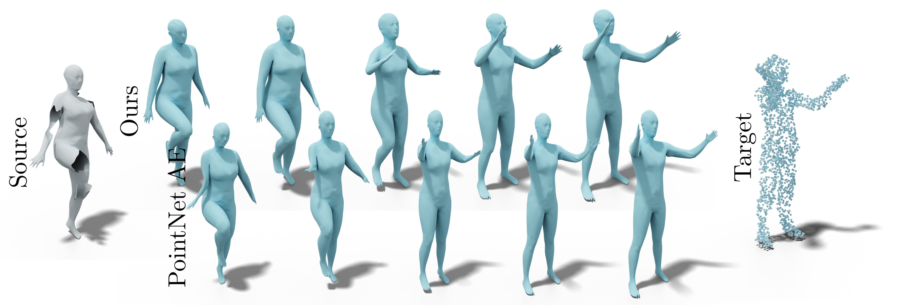

# Intrinsic Point Cloud Interpolation via Dual Latent Space Navigation
This is our implementation of the architecture presented in the paper "Intrinsic Point Cloud Interpolation via Dual Latent Space Navigation". The network is designed to preserve intrinsic shape properties during shape manipulations.





This code was written by [Marie-Julie Rakotosaona](http://www.lix.polytechnique.fr/Labo/Marie-Julie.RAKOTOSAONA/), based on the excellent implementation of Pointnet Autoencoder by [Charles R. Qi](https://web.stanford.edu/~rqi/).

## Prerequisites
* CUDA and CuDNN (changing the code to run on CPU should require few changes)
* Python 2.7
* Tensorflow 1.14

## Setup
Install required python packages, if they are not already installed :
``` bash
pip install trimesh
```


Clone this repository:
``` bash
git clone https://github.com/mrakotosaon/intrinsic_interpolations.git
cd intrinsic_interpolations
```


Download datasets:
``` bash
cd data
python download_data.py
```


 ## Data

Our surreal+dfaust dataset can be found here: https://nuage.lix.polytechnique.fr/index.php/s/gJDLtEwcgLwRwTc
It contains the following files:
- A shape template .ply file that is used only for the triangulation.
- The dataset described in the paper.


## Training
To train the network with the default settings:
### 1. Train edge autoencoder and shape vae:
``` bash
python train_edge_ae.py
python train_shape_vae.py
```
### 2. Train mapping networks:

``` bash
python train_mapping.py --best_edge_ae_epoch n1 --best_shape_vae_epoch n2
```

Where n1 and n2 represent the best epoch of each previously trained network.

## Citation
If you use our work, please cite our paper.
